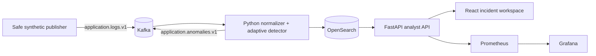

# LogSentinel

**LogSentinel** is an incident-investigation workspace that ingests synthetic application logs, derives explainable anomaly scores, creates an alert lifecycle, and exposes observability metrics. It is designed as a portfolio lab rather than a production monitoring replacement: the included scenario uses no customer, credential, financial, or production-log data.

> The central design principle is **operator-assist, not autonomous remediation**. Every flagged event retains explicit baseline evidence so an analyst can decide whether to investigate, resolve, or escalate.

| Capability | Portfolio implementation | Why it matters in an interview |
|---|---|---|
| Streaming ingestion | Kafka raw-log and anomaly topics, with idempotent event processing | Shows event-driven system design and consumer-safety thinking. |
| Detection | Online, service-specific latency baseline plus error-signature novelty | Demonstrates interpretable anomaly analysis without relying on an opaque model. |
| Investigation | React analyst workspace with evidence, log stream, score, and lifecycle state | Connects backend detection to a usable incident-response workflow. |
| Search/indexing | OpenSearch-compatible adapter in the full Compose lab; deterministic in-memory fallback locally | Shows separation between operational deployment and reproducible review. |
| Observability | Prometheus counters/histograms and a provisioned Grafana dashboard | Demonstrates that the monitoring service itself is monitored. |

## System topology



The full lab uses Kafka to transport records between producers and consumers, while the detector writes investigation records to OpenSearch. Kafka’s documentation describes the platform as an event-streaming system, and OpenSearch documents a query API for indexing and searching JSON documents. [1] [2]

## Demonstrate locally without Docker

The deterministic path is deliberately the fastest review route. It starts an in-memory repository and runs a fixed safe incident path: five normal checkout events, two payment gateway timeouts, and one normal catalog event. It contains only fabricated technical messages.

| Terminal | Command | Expected result |
|---|---|---|
| 1 | `pip install -e ".[test]"` | Installs API, test, and lint dependencies. |
| 1 | `make api` | Starts FastAPI at `http://127.0.0.1:4300`. |
| 2 | `cd apps/web && npx --yes pnpm@10.6.3 install && npx --yes pnpm@10.6.3 run dev` | Starts the React workspace at `http://127.0.0.1:5177`. |
| Browser | Select **Run incident scenario** | Produces a high-confidence synthetic payment-outage alert. |
| Browser | Choose **Investigating** or **Resolved** | Demonstrates the alert lifecycle. |

To inspect the API directly, call `POST /api/demo/seed`, then view `GET /api/overview`, `GET /api/logs`, and `GET /metrics`. Re-running the scenario is idempotent: stable synthetic event identifiers prevent duplicate processing.

## Run the full observability lab

The Compose topology enables Kafka, OpenSearch, API, worker, Prometheus, Grafana, and the React workspace. Docker is required for this optional architecture demonstration.

```bash
docker compose up --build
# In a separate terminal after Kafka and the worker are healthy:
docker compose exec worker python -m apps.worker.demo_producer
```

The endpoints are `http://localhost:8080` for the analyst workspace, `http://localhost:4300/docs` for API documentation, `http://localhost:9200` for local OpenSearch, `http://localhost:9090` for Prometheus, and `http://localhost:3000` for Grafana. The local Grafana credentials (`admin` / `admin`) are intentionally limited to this lab and must not be used outside a development environment.

Prometheus describes itself as a systems and service monitoring toolkit and its query language enables the dashboard’s rate and histogram queries. [3]

## Detection model and alert policy

For each service, the detector stores a running latency mean and variance using an online moment update. Once the baseline has at least three samples, latency at or beyond three standard deviations contributes 0.55 to the score; an unusual error level contributes 0.45; a new error signature contributes 0.20; and a correlated burst tag contributes 0.20. The score is capped at 1.0 and an alert opens at **0.67** or higher.

| Signal | Contribution | Explanation shown to analyst |
|---|---:|---|
| Latency ≥ 3σ from service baseline | 0.55 | “latency is Xσ from the service baseline” |
| Error where historical error rate is under 25% | 0.45 | “error level is unusual for this service baseline” |
| New error signature | 0.20 | “error signature has not appeared in the current baseline” |
| Correlated burst marker | 0.20 | “event is part of a correlated error burst” |

This transparent policy is intentionally easier to review and explain than automatic remediation. It should be calibrated against representative, privacy-reviewed telemetry before use in a real environment.

## Security and data boundaries

Log data can contain sensitive information, so the safe default is to exclude personal data, access tokens, authorization headers, credentials, and payment details before publishing an event. LogSentinel’s included scenario uses only fictional service names and messages. In a real deployment, add structured redaction at the producer boundary, least-privilege identity for Kafka/OpenSearch, TLS, encrypted storage, auditability for alert transitions, and retention rules approved by the organization.

The compose configuration disables OpenSearch security only because it is a self-contained local lab. Do not copy that setting into a network-accessible deployment. The OpenSearch security documentation describes the security plugin and its configuration capabilities. [4]

## Quality gates

```bash
ruff check apps tests
pytest -q
cd apps/web && npx --yes pnpm@10.6.3 run lint && npx --yes pnpm@10.6.3 run test && npx --yes pnpm@10.6.3 run build
```

The GitHub Actions workflow executes the same Python and web quality checks on pushes and pull requests. All configuration exposed by the project uses the `LOGWATCH_` namespace to reduce cross-project environment-variable collisions.

## Project structure

```text
apps/api/                 FastAPI analyst API and container definition
apps/worker/              schemas, online detector, Kafka worker, OpenSearch adapter
apps/web/                 React and Vite incident-investigation workspace
grafana/                  provisioned datasource and dashboard
tests/                    deterministic API and processing tests
compose.yaml              full local observability lab
prometheus.yml            scrape configuration
```

## References

[1]: https://kafka.apache.org/documentation/ "Apache Kafka documentation"
[2]: https://docs.opensearch.org/latest/ "OpenSearch documentation"
[3]: https://prometheus.io/docs/introduction/overview/ "Prometheus overview"
[4]: https://docs.opensearch.org/latest/security/ "OpenSearch Security documentation"
